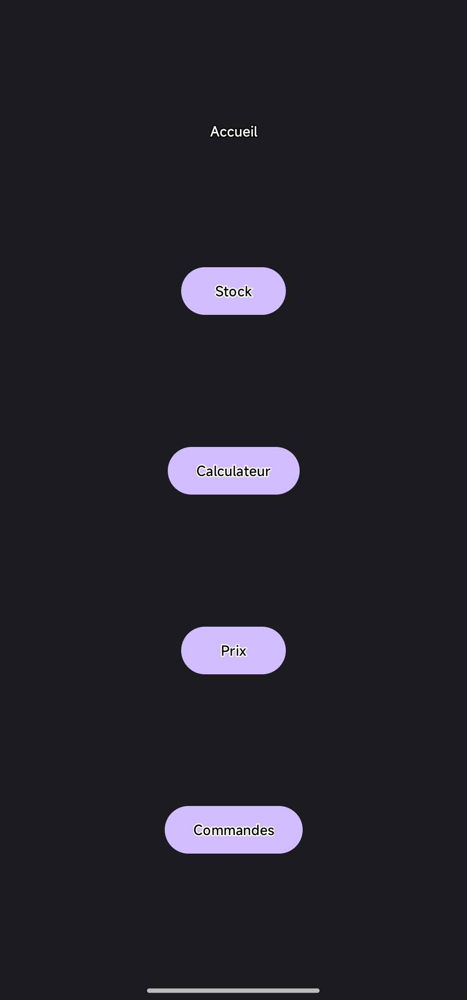
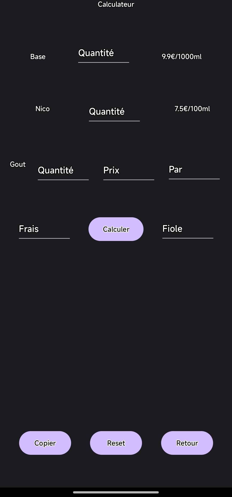
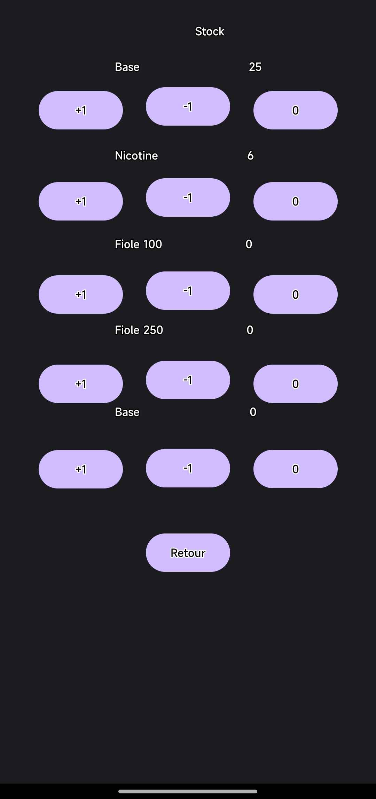
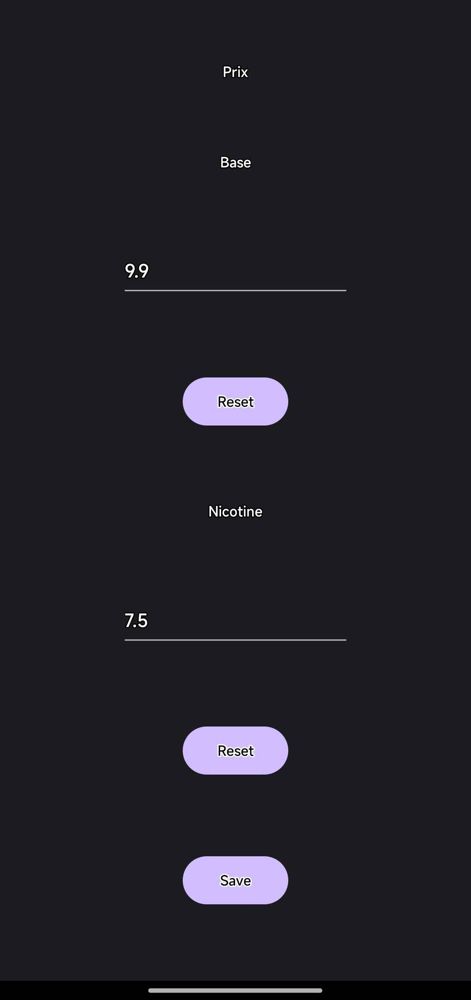

# LPVCommandes

Gérer vos ventes de gouts LPV en gérant les prix, en calculant le prix de production et voptre stock de gouts.

## Fonctionnalités


- Stock
- 
- Calculateur
- 
- Prix
- 

## Prérequis

Avant d'installer ou d'utiliser ce projet, assurez-vous d'avoir les éléments suivants :

- [Exemple : Java JDK 11+](https://www.oracle.com/java/technologies/javase-jdk11-downloads.html)
- [Exemple : Android Studio](https://developer.android.com/studio)

## Installation

1. Clonez ce dépôt :

   ```bash
   git clone https://github.com/NiavlySDev/LPVPerso.git
   ```

2. Accédez au dossier du projet :

   ```bash
   cd LPVPerso
   ```

3. Installez les dépendances si nécessaire ou configurez votre environnement.

## Utilisation

1. Installer l'apk dans les releases


Ou, dans un projet Android :

1. Ouvrez le projet dans Android Studio.
2. Synchronisez les dépendances.
3. Lancez l'application sur un émulateur ou un appareil.

## Contributions

Les contributions sont les bienvenues ! Pour contribuer :

1. Forkez le projet.
2. Créez une branche pour votre fonctionnalité (`git checkout -b fonctionnalite-amelioree`).
3. Effectuez les changements nécessaires et validez-les (`git commit -m "Ajout d'une nouvelle fonctionnalité"`).
4. Poussez votre branche (`git push origin fonctionnalite-amelioree`).
5. Créez une Pull Request.

## Auteurs

- **Sylvain Crocquevieille (NiavlySDev)** - _Créateur_ - [Profil GitHub](https://github.com/NiavlySDev)